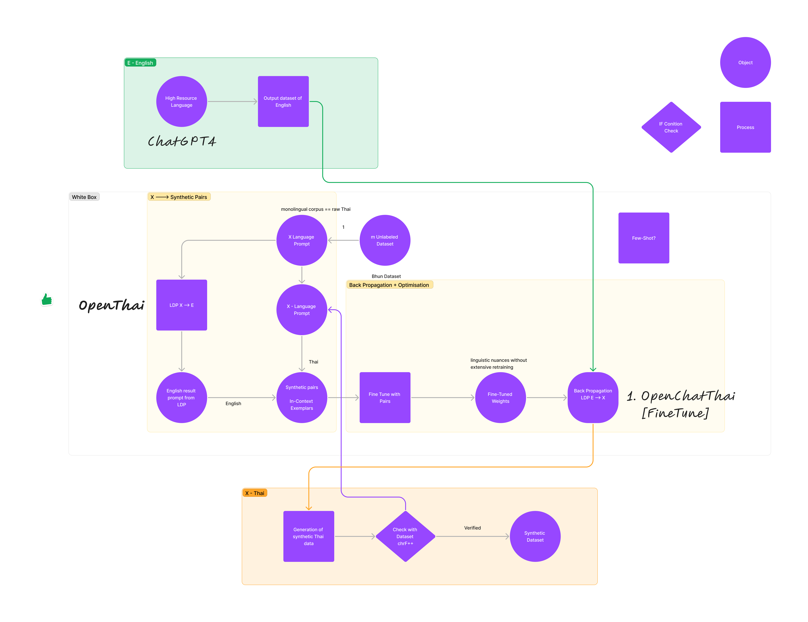
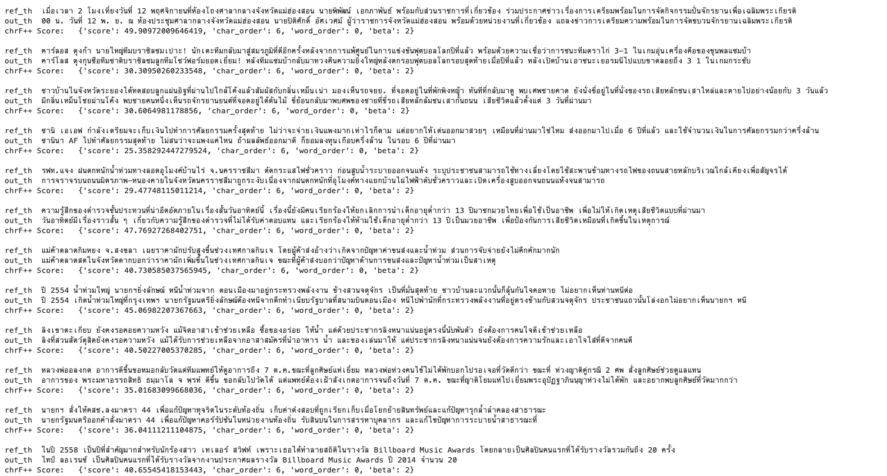

  

Apologies for the lack of history commit. There was a lot of problem with the code when running on Runpod.
Most are run in the notebook and different instance on RunPod, there might be dependency issue.

0. First `cd LDP`

1. Run `1OpenThaiGPT Forward Prop_CUSTOM.ipynb`
    - Download the custom Thai dataset and translate them using OpenThaiGPT model
    - output is `out_synthetic_pairs2.csv` which is not Fine-tune friendly
    - output is `out_synthetic_pairs2_clean.csv` max rows for testing for final fine-tuning
    - output is `out_synthetic_pairs2_clean_lil.csv` 300 rows for testing if the fine-tuning works on the synthetic dataset

2. Run `2OpenThaiGPT FineTuning_CUSTOM.ipynb`
    - load and convert the csv file to Fine-tune friendly format
    - output, model as weights @ `LDP/openthaigpt-finetune/synthetic_v2`

3. Run `3OpenThaiGPT_run.ipynb`
    - load the model and run the inference with the weights from `LDP/openthaigpt-finetune/synthetic_v2`
    - Use Gradio to prompt
    - Use `Input: Why is the sky so blue today?  Instruction: แปลอังกฤษเป็นภาษาไทย` ---> `Output: ทำไมท้องฟ้าวันนี้ถึงมีสีคราม?`
    - High temp, High top_k, , BEAM = 4, Low top_p, Stream ON

4. Run all `4Evaluation_chrF++.ipynb`
    - load the base model with the weights from `LDP/openthaigpt-finetune/synthetic_v2`
    - load the synthetic dataset from `LDP/out_synthetic_pairs2_clean.csv`
    - run the inference and calculate the chrF++ score, comparing the Thai unlabeled dataset

  

  

Written by Tinapat Limsila
